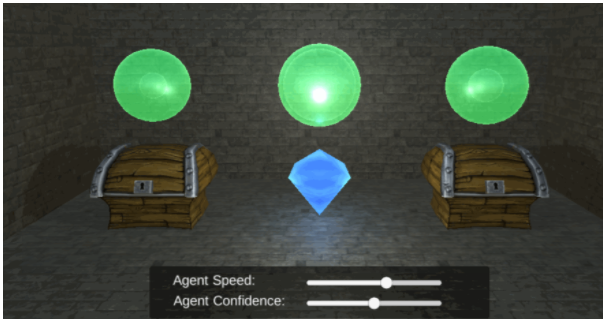

## AI
### 增强算法（RL）
        在RL中，实施动作的个体被称为agent（代理），它使用policy（策略）进行动作决策。一个代理通常嵌于一个environment（环境）中，并在任意给定的时刻都处于某个特定的state（状态）。从那个状态，它可以进行一系列actions（动作）。某个给定状态的value（值）指的是处于该状态的最终回报价值。在某个状态执行一个动作可以让代理进入另一个新的状态，获得一个reward（回报），或者同时拥有两者。所有RL代理都在尽可能最大化总累计回报。
##### 采用上下文老虎机算法的增强学习算法
###### 参考网站
	http://forum.china.unity3d.com/thread-25088-1-1.html
---------
###### 核心思想

	给每一次行为进行价值估计，在初始价值上面增加或减少该价值估计。每一次开箱子，如果开出钻石，则价值估计增加，反之减少。下一次的行为根据上一次的价值估计进行选择新一轮的行为。相当于给三个箱子一个初始的概率1/3；起初，选择三个箱子的概率都是一样，当玩家（第一次行为：打开1号箱子）如果出现钻石，则她的概率增加，反正，概率减少。
###### 代码实现
	1.进行环境的配置
	2.初始化agent（代理）
	3.选择箱子，获得回报
	4.添加回报，循环234
##### 基于Q-Learning的强化学习
###### 贝尔曼方程
		贝尔曼方程是动态规划（Dynmic Programming）这些种数学最佳化方法能够达到最佳化的必要条件。此方程把“决策问题在特定时间怎么的值”以“来自初始选择的报酬比从初始选择衍生的决策问题的值”的形式表示。借此这个方式把动态最佳化问题变成简单的子问题，而这些子问题遵守从贝尔曼所提出来的“最佳化还原理”。