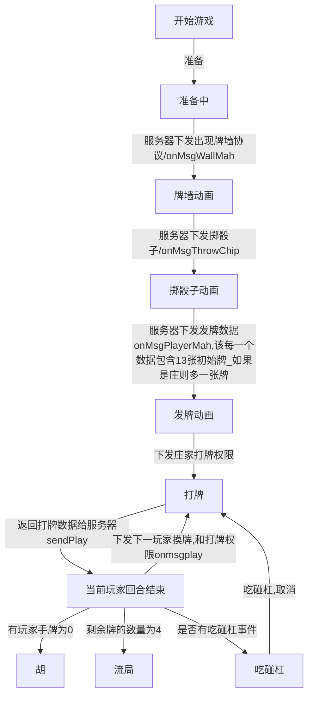
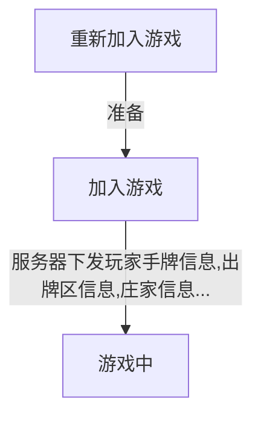

### 3D麻将流程图

#### 打牌流程

```mermaid
graph TB
　　开始游戏-->|准备|准备中;
　　准备中-->|服务器下发出现牌墙协议/onMsgWallMah|牌墙动画;
　　牌墙动画-->|服务器下发掷骰子/onMsgThrowChip|掷骰子动画;
　　掷骰子动画-->|服务器下发发牌数据onMsgPlayerMah,该每一个数据包含13张初始牌_如果是庄则多一张牌|发牌动画;
　　发牌动画-->|下发庄家打牌权限|打牌;
　　打牌-->|返回打牌数据给服务器sendPlay|当前玩家回合结束;
　　
　　当前玩家回合结束-->|下发下一玩家摸牌,和打牌权限onmsgplay|打牌;
　　当前玩家回合结束-->|有玩家手牌为0|胡;
　　当前玩家回合结束-->|剩余牌的数量为4|流局;
　　当前玩家回合结束-->|是否有吃碰杠事件|吃碰杠;
　　吃碰杠-->|吃碰杠,取消|打牌;
```

#### 断线重连流程

```mermaid
graph TB
　　重新加入游戏-->|准备|加入游戏;
　　加入游戏-->|服务器下发玩家手牌信息,出牌区信息,庄家信息...|游戏中;
```
