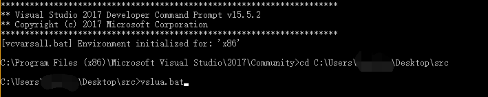

#### Lua 使用SubLime编译  

###### 制作编译器  

1.[下载lua源代码](http://www.lua.org/download.html)

2.进入src文件，新建文件vslua.bat并用text打开

3.复制并黏贴以下代码

```
copy lua.c lua.1
copy luac.c lua.2
del lua.c luac.c
cd ../
md bin
cd ./src

cl -c -nologo -W3 -O2 -Ob1 -Oi -Gs -MD *.c
link -lib -out:lua5.1.lib -verbose:lib *.obj
cd../
copy src\lua5.1.lib bin\lua5.1.lib
cd./src
del *.obj *.lib

cl -c -nologo -O2 -Ob1 -Oi -Gs -MD -DLUA_BUILD_AS_DLL-D_CRT_SECURE_NO_DEPRECATE *.c
link -link -dll -out:lua5.1.dll -verbose:lib*.obj
cd../
copy src\lua5.1.dll bin\lua5.1.dll
cd./src
del *.obj *.dll

copy lua.1 lua.c
cl -c -nologo -O2 -Ob1 -Oi -Gs -MD *.c
link -link -out:lua.exe -verbose:lib *.obj
cd../
copy src\lua.exe bin\lua.exe
cd./src
del *.obj *.exe lua.c

copy lua.2 luac.c
cl -c -nologo -O2 -Ob1 -Oi -Gs -MD *.c
link -link -out:luac.exe -verbose:lib *.obj
cd../
copy src\luac.exe bin\luac.exe
cd./src
del *.obj *.exe luac.c *.exp *.lib

copy lua.2 luac.c
copy lua.1 lua.c
del lua.1 lua.2
```

4.选择vs的开发人员命令提示工具，打开vslua.bat文件。则会在同级目录产生一个bin文件



5.将bin和src文件放在任意位置。

###### 环境配置

1.环境变量中添加lua


2.在Path中配置`%lua%`,如果在`%lua%`前没有`;`，则加上。

3.在sublime中直接使用`F7`运行即可执行
4.
参考链接：https://jingyan.baidu.com/article/359911f551917457fe0306e5.html?qq-pf-to=pcqq.c2c