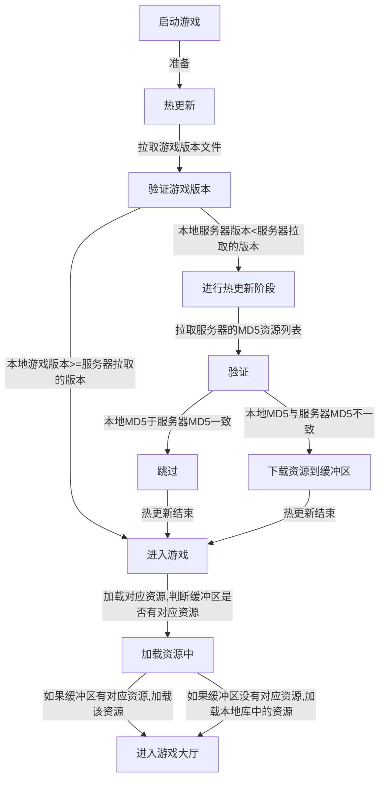

## 热更新流程

热更新一般需要包含以下东西：

1.URL1:游戏版本配置文件地址

2.URL2:所有资源的MD5配置文件地址

```mermaid
graph TB
　　启动游戏-->|准备|热更新;
　　热更新-->|拉取游戏版本文件|验证游戏版本;
　　验证游戏版本-->|本地服务器版本<服务器拉取的版本|进行热更新阶段;
　　验证游戏版本-->|本地游戏版本>=服务器拉取的版本|进入游戏;
　　进行热更新阶段-->|拉取服务器的MD5资源列表|验证;
　　验证-->|本地MD5于服务器MD5一致|跳过;
　　验证-->|本地MD5与服务器MD5不一致|下载资源到缓冲区;
　　跳过-->|热更新结束|进入游戏;
　　下载资源到缓冲区-->|热更新结束|进入游戏;
　　进入游戏-->|加载对应资源,判断缓冲区是否有对应资源|加载资源中;
　　加载资源中-->|如果缓冲区有对应资源,加载该资源|进入游戏大厅;
　　加载资源中-->|如果缓冲区没有对应资源,加载本地库中的资源|进入游戏大厅;
```

github地址：