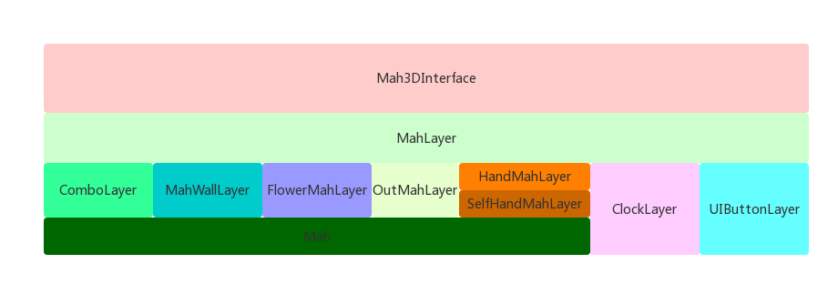

## 3D麻将框架开发--lua

### 3D 麻将框架图



1. Mah3DInterface向外界暴露出麻将接口，比如显示牌墙、显示吃碰杠等；
2. MahLayer主要负责初始化各个模块--ComboLayer、MahWall、FlowerMahLayer、Outmahlayer、HandMahLayer、ClockLayer、UIButtonLayer等模块，以及实现大部分功能，统筹规划和调用上述的各个模块；
3. ComboLayer层负责实现麻将吃碰杠的显示；
4. MahWall主要负责麻将牌墙的显示；
5. FlowerMahLayer主要负责显示花牌；
6. OutMahLayer主要负责出牌区的显示；
7. HandmahLayer主要负责手牌的显示；
8. SelfHandMahLayer继承HandMahLayer，主要添加了手牌的触摸事件
9. ClockLayer主要负责计时器的显示；
10. UIButtonLayer主要负责吃碰杠等按钮的显示
11. Mah最底层的单个麻将子。

### 3D麻将单个模块的具体实现

1. Mah

```lua

```

2. ClockLayer
```lua
local clock
local scheduler=cc.Director:getInstance():getScheduler()
--初始化
function ClockLayer:Init(rootNode)
  clock=cc.CSLoader:createNodeWithVisibleSize("")
  rootNode:addChild(clock)
end
-- 开始时间
-- @param direct 方向或者是位置
-- @param time 计时器的时间
-- @return nil
function ClockLayer:StartClock(direct,time)
  clock:setVisible(true)
end
-- 结束计时器
function ClockLayer:StopClock()end
-- 重置计时器
function ClockLayer:ResetClock()end
```
3. UIButtonLayer
```lua
local buttonLists={}
local uiButtonLayer
-- 初始化
function UIButtonLayer:Init(rootNode)
  uiButtonLayer=cc.CSLoader:createNodeWithVisibleSize("")
  rootNode:addChild(uiButtonLayer)
  self:addButtonEvent()
end
-- 添加Button的点击事件
function UIButtonLayer:addButtonEvent()end
-- 显示Button
function UIButtonLayer:ShowButton()end
```
4. HandMahLayer
```lua

```
5. SelfHandMahLayer
```lua

```
6. OutMahLayer
```lua

```
7. FlowerMahLayer
```lua

```
8. MahWallLayer
```lua

```
9. ComboLayer


```lua

```

