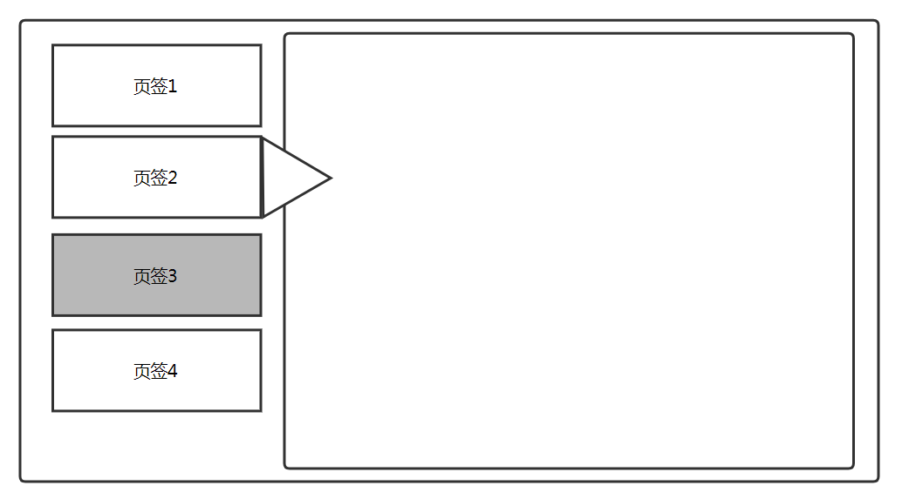

### cocos lua button用法

Button 图片显示有三种状态：普通状态、按下状态、禁用状态

Button触摸状态有可触摸和禁用状态。

### Button制作页签



设计：左侧为UI导航栏，上面布有4个按钮，按钮有3中状态：被选中的页签2，禁用的页签3，可以点击的页签1、4。右侧为一个大的节点。节点上加载按钮对应的页面。

```lua
--buttons 页签配置，0为正常状态，1存储禁止状态，2存储显示状态
local buttons={
  "buttons1"=0,
  "buttons2"=0,
  "buttons2"=0,
  "buttons2"=0,
}
```


