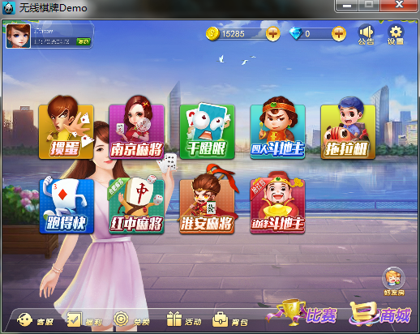

#### cocos2D的屏幕适配
版本cocos2dx3.3屏幕适配做的很差劲，官方的屏幕适配方案有以下四种
``` C++
		_scaleX = (float)_screenSize.width / _designResolutionSize.width;
        _scaleY = (float)_screenSize.height / _designResolutionSize.height;
        
        if (_resolutionPolicy == ResolutionPolicy::NO_BORDER)//第一种，以最大放大因子放大资源，裁剪一部分信息
        {
            _scaleX = _scaleY = MAX(_scaleX, _scaleY);
        }
        
        else if (_resolutionPolicy == ResolutionPolicy::SHOW_ALL)//第二种，以最小放大因子放大资源，不足红黑边填充
        {
            _scaleX = _scaleY = MIN(_scaleX, _scaleY);
        }
        
        else if ( _resolutionPolicy == ResolutionPolicy::FIXED_HEIGHT) {//以高的资源分辨率的放大因子为准，忽略宽，有可能造成黑边或者信息被裁减。
            _scaleX = _scaleY;
            _designResolutionSize.width = ceilf(_screenSize.width/_scaleX);
        }
        
        else if ( _resolutionPolicy == ResolutionPolicy::FIXED_WIDTH) {//以宽的资源分辨率的放大因子为准，忽略高
            _scaleY = _scaleX;
            _designResolutionSize.height = ceilf(_screenSize.height/_scaleY);
        }
        
        // calculate the rect of viewport
        float viewPortW = _designResolutionSize.width * _scaleX;
        float viewPortH = _designResolutionSize.height * _scaleY;
        
        _viewPortRect.setRect((_screenSize.width - viewPortW) / 2, (_screenSize.height - viewPortH) / 2, viewPortW, viewPortH);
        
        // reset director's member variables to fit visible rect
        auto director = Director::getInstance();
        director->_winSizeInPoints = getDesignResolutionSize();
        director->createStatsLabel();
        director->setGLDefaultValues();
```
当前博客讲的是第四种方案，以高度为基准，在资源为1280x800，高宽比为1.6分辨率的条件下进行适配。适配以下分辨率480：320、960*640、1136：640、1024：768、854：480、1280：720、1920：1080、2048x1536，高宽比分别为16：9，3：2，1.775，1.333


######原图是：
######层级关系图
```lua
        glView:setDesignResolutionSize(1280,800,4)--实例化窗口的时候调用，选择4即为ResolutionPolicy::FIXED_HEIGHT
```
```lua

wolf = wolf or {}
local FixUIUtils = {}
--local BUI = bf.UIManager:getInstance()
local BUI=cc.Director:getInstance():getRunningScene()
--屏幕像素
local screenSize = cc.Director:getInstance():getOpenGLView():getFrameSize()
local designSize = cc.size(1280,800)

--修正场景
function FixUIUtils.fixScene()
    local bg=wolf.UIManager.seekNodeByName(BUI, "SceneBack")--获得背景层，让背景层在各种分辨率下不显示黑边
    if(screenSize.height/designSize.height>=screenSize.width/designSize.width)then
        local oldScale=screenSize.width/designSize.width
        local newScale=bg:getScale()/oldScale*screenSize.height/designSize.height--放大比例，在setDesignResolutionSize的时候就已经放大过一回，那么我们要先将图片回滚到原先大小，在进行变化
        bg:setScale(newScale)
    end
    //获得第一层，设置他的位置
    local node=wolf.UIManager.seekNodeByName(BUI, "KW_MAIN_TOP_BACK")
    node:setPositionY(designSize.width/screenSize.width*screenSize.height)
    //获得第二层，设置位置
    local list=wolf.UIManager.seekNodeByName(BUI, "KW_MAIN_GAME_LAYOUT")
    local x,y=list:getPosition()
    local temp=screenSize.width/designSize.width*y
    list:setPositionY(designSize.width/screenSize.width*screenSize.height/2)
end
return FixUIUtils
```
######最终效果
1024x768：

2048x1536：

480x320：


其他基本相似。没有太大的变形和不协调之处。
