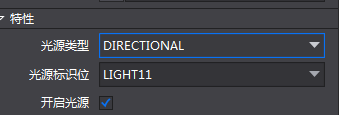
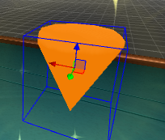
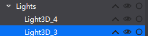
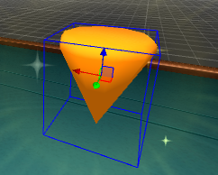

#### cocos3D的多光源照射问题

在我的场景中有许多的光源，现在一个物体需要指定这些光源中特定的几个光源影响。

在cocos中，目前我知道的有三种照射方式：

1.单光源：这种方式是物体只受一个光源的影响。忽略其他光源的影响。
2.多光源：这种方式是物体受所有光源的影响。
3.特定光源：这种方式是物体只受特定光源的影响。

###### 1.单光源

​	单光源只需要在cocos studio设置光源标识位或者在代码中设置setLightMask(cc.LightFlag.LIGHT0)即可。



###### 2.多光源

​	多光源则是在代码中设置setLightmask（-1），即可表示该物体受全部光源影响

###### 3.特定光源

​	在cocos studio中，光有两个属性，光照类型和光照标识位（我感觉是相当于cocos预先生成n个光源）。使用不同光照类型相同标识位的光源就可以达到一个物体受特定几个光源照射。

​	在不使用光照的情况下：



​	在cocosstudio中新建两个光源：方向光和环境光。光源和物体的光源标识位都设置为LIGHT11。则最后效果为：



##### 还存在的问题

在官方文档中，可以设置shader中支持的最大光源数目，并且把它放在一个配置文件中，如下：

```
<key>cocos2d.x.3d.max_dir_light_in_shader</key>
<integer>1</integer>
<key>cocos2d.x.3d.max_point_light_in_shader</key>
<integer>1</integer>
<key>cocos2d.x.3d.max_spot_light_in_shader</key>
<integer>1</integer>
```

但是可惜的是我无从着手。如果你会的话，请留言告诉我谢谢！