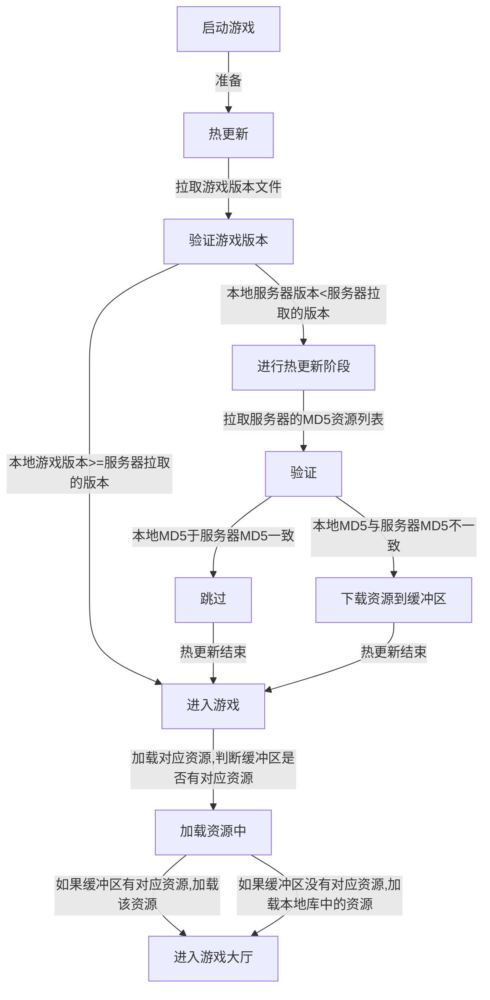
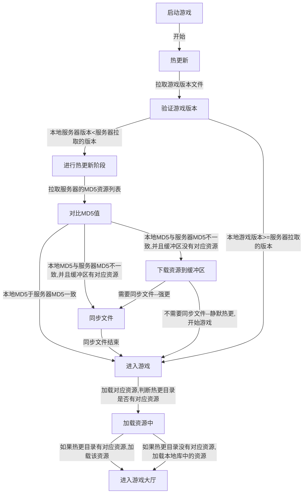

## 热更新流程

热更新一般需要包含以下东西：

1.URL1:游戏版本配置文件地址

2.URL2:所有资源的MD5配置文件地址

##### 问题
 如果将热更新分为强更和弱更（静默更新），以上的更新策略将会不支持静默更新。

###### 新策略

在下载资源到缓冲区后添加一步是否同步文件。如果直接同步文件则为强更，如果不直接同步文件则为静默更新。在下一次进入游戏的时候判断是否有文件未同步--先同步再检查热更新。

github地址：