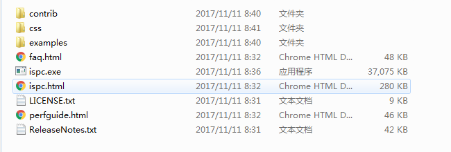
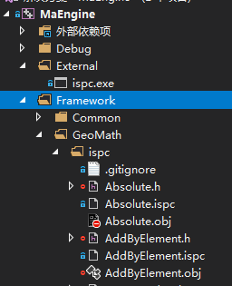
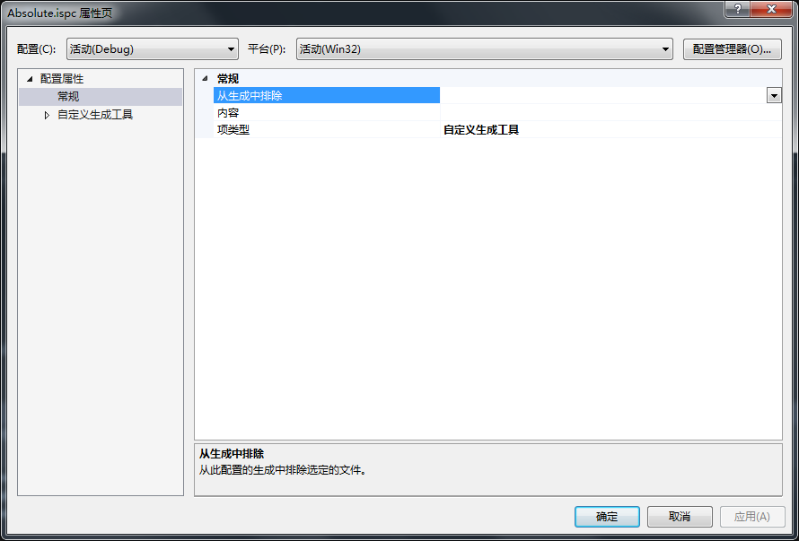
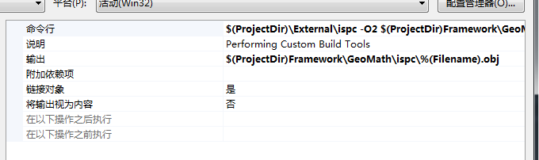

### Intel SPMD Program Compiler在VS2017中的使用

本文不讲Intel SPMD Program Compiler的语法，之讨论ispc如何在vs中编译。

注意事项：vs工程不能有中文路径，否则.ispc无法编译

#### 准备工作：

1.下载 ispc：在[Intel SPMD Program Compiler](http://ispc.github.io/documentation.html)下载最新版ispc。我们只需要关注ispc。exe和ispc.html即可。ispc.exe是编译器，ispc.html是ispc的使用解释。ispc的用法可以参照examples中的例子。



2.新建一个vs工程，将ispc放入vs工程中。如下图所示:将ispc放置在External中



3.在Framework/Geomath/ispc目录下新建.ispc文件。例如Absolute.ispc。

4.访问Absolute.ispc的属性。将Absolute.ispc项类型更改为自定义生成工具。



5.配置自定义生成工具

​	首先配置命令行：我的项目工程中的配置方式为

```
$(ProjectDir)\External\ispc -O2 $(ProjectDir)Framework\GeoMath\ispc\%(Filename).ispc -o $(ProjectDir)Framework\GeoMath\ispc\%(Filename).obj -h $(ProjectDir)Framework\GeoMath\ispc\%(Filename).h --opt=fast-math --arch=x86
```

```
$(ProjectDir)\External\ispc 为ispc.exe的路径。
$(ProjectDir)Framework\GeoMath\ispc\%(Filename).ispc 为要编译的.ispc文件路径
$(ProjectDir)Framework\GeoMath\ispc\%(Filename).obj和$(ProjectDir)Framework\GeoMath\ispc\%(Filename).h为编译后.obj和.h的路径。最好跟.ispc路径相同，在我的尝试中如果不一样会存在问题。报找不到错误。
```

​	配置输出：

```
$(ProjectDir)Framework\GeoMath\ispc\%(Filename).obj
```

```
$(ProjectDir)Framework\GeoMath\ispc\%(Filename).obj//这个路径必须与命令行中的.obj路径一致。
```

​	链接对象：必须为是



本文提供的项目[地址](https://github.com/BangjinMa/MaEngine)