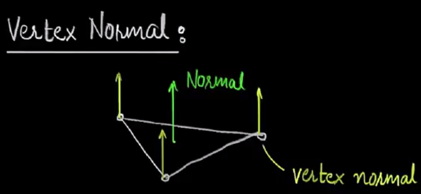

### 法线
#### 2D法线
	在2D的曲线上取一个点，然后做该点的切线（tangent）,法线即是该点切线的垂线。
### 3D法线
	在3D的曲面上取一个点，然后做该点的切线平面，法线即是该平面的垂线。
#### 顶点法线问题
	1.在一个简单平面中（如三角形平面），顶点的法线即是该平面的法线。

	2.在几何多面体中，一个顶点由多个面片连接而成，则该顶点具有所有组合成该点的面片的法线。

#### 利用法线，做一个顶点动画
	1。定义一个输入结构体和输出结构体
``` Shader

strut VertInput{
    float4 vertex : POSITION;
    float4 normal:Normal;
    float2 uv : TEXCOORD0;
}
strut v2f{
    float2 uv : TEXCOORD0;
	float4 vertex : SV_POSITION;
}
```
	2.在顶点着色器中改变顶点的坐标
``` Shader
float4 vertexAnimNormal(float4 position,float4 vertNormal,float2 uv){
    position+=sin(vertNormal-(_Time.y* _Frequency))*(vertNormal*_Amplitude);
	return position;
}
v2f Vert(VertInput i){
    v2f o;
    v.vertex=vertexAnimNormal(v.vertex,v.normal,v.uv.xy);
    UNITY_INITIALIZE_OUTPUT(v2f,o);
    o.vertex=UnityObjectToClipPos(v.vertex);
    o.uv.xy = (v.uv.xy * _MainTex_ST.xy+_MainTex_ST.zw);
    return o;
}
```
	3.在面着色器中输出
``` Shader
fixed4 frag (v2f i) : SV_Target
{
	float4 col = tex2D(_MainTex, i.uv)*_Color;
	return col;
}
```