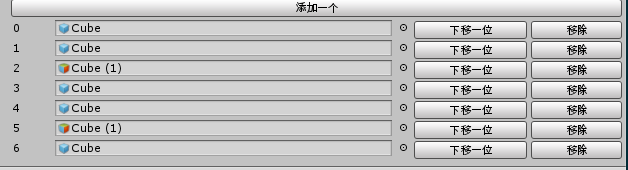
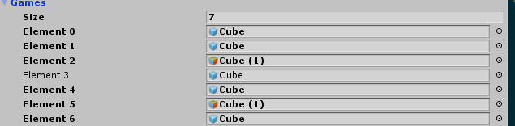

## unity中使用inspector的重写问题
	1.在InSpector的重写要保存数据，这就要使用一下方法
|方法名|使用说明|
|-|-|
|EditorUtility.SetDirty()|在5.3以后，标记场景的更改，不能再标记修改场景中的对象EditorUtility.SetDirty(target)|
|Undo.RecordObject()|标记场景中的对象所做的任何更改，这段代码要放在更改之前Undo.RecordObject(target,"string name")|
|SerializedObject.Update(), EditorGUILayout.PropertyField(), and SerializedObject.ApplyModifiedProperties().|更改可序列化组件或者资源的属性|
|EditorSceneManager.MarkSceneDirty()|标记场景中的文件并不想要有撤销功能|
	2.在InSpector中使用GUILayout.BeginHorizontal()和GUILayout.EndHorizontal()达到横板排列的功能。
	3.为了能够InSpector面板中将GameObject[]拖拽到属性栏里面，则要可以使用以下两种方法。
		1) mp.game[i] = (GameObject)EditorGUILayout.ObjectField(mp.game[i], typeof(GameObject), true);用for循环包裹达到效果
``` C#
MyPlayer mp = (MyPlayer)target;
Undo.RecordObject(target,"dad");//标记修改

GUILayout.BeginHorizontal();
if (GUILayout.Button("添加一个"))
{
	Debug.LogError("上移一位");
	mp.Add();
}
GUILayout.EndHorizontal();
for (int i = 0; i < mp.games.Count; i++)
{
	GUILayout.BeginHorizontal();
	GUILayout.Label(i.ToString(), GUILayout.Width(40));
	mp.games[i] = (GameObject)EditorGUILayout.ObjectField(mp.games[i], typeof(GameObject), true);
	if (GUILayout.Button("下移一位"))
	{
		Debug.LogError(i.ToString());
	}
	if (GUILayout.Button("移除"))
	{
		Debug.LogError(i.ToString());
	}
	GUILayout.EndHorizontal();
}
```

        2) EditorGUILayout.PropertyField(serializedObject.FindProperty("games"),true);生成一个数组
``` C#
        GUIContent content = new GUIContent();
        EditorGUILayout.PropertyField(serializedObject.FindProperty("games"), true);
        serializedObject.ApplyModifiedProperties();
        GUILayout.BeginHorizontal();
        GUILayout.Label("预制体", GUILayout.Width(40));
        mp.manager = (GameObject)EditorGUILayout.ObjectField(mp.manager, typeof(GameObject), true);
        GUILayout.EndHorizontal();
```
