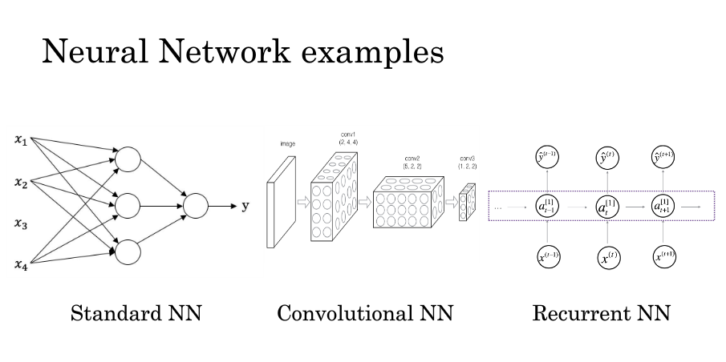

### 什么是神经网络
#### 神经网络分类

1.标准神经网络：一般用于处理每个属性有明确定义的神经网络，就像房价取决于大小，卧室数量等一样，有明确的定义。

2.卷积神经网络：一般用于图片的处理

3.循环神经网络：一般用于序列数据，一维数据序列，比如向视频、音频。

4.混合神经网络：
#### 术语
Structured Data:结构化数据-是数据的数据库。有着明确、清晰定义的

UnStructured Data:非结构化数据