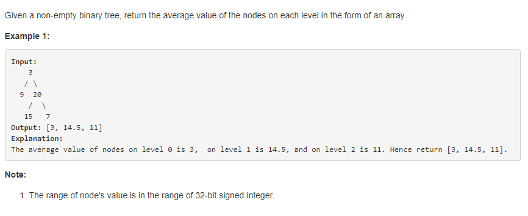

####637Submission Details



#####思路

使用递归重复的往open表里面添加何删除待遍历的层数。

######代码
```language
vector<double> push(list <TreeNode> &open, vector<double> &averages) {
        if (!open.size())
            return averages;
        double sum = 0;
        int amout = 0;
        for (auto iter = open.begin(); iter != open.end(); iter++) {
            sum = (*iter).val + sum;
            amout++;
        }
        averages.push_back(sum / amout);
        list <TreeNode> list{};
        for (auto iter = open.begin(); iter != open.end(); iter++) {
            if ((*iter).left)
                list.push_back(*((*iter).left));
            if ((*iter).right)
                list.push_back(*((*iter).right));
        }
        averages = push(list, averages);
        return averages;
    }

    vector<double> averageOfLevels(TreeNode *root) {
        vector<double> averages{};
        averages.push_back(root->val);

        list <TreeNode> open{};
        if (root->left)
            open.push_back(*(root->left));
        if (root->right)
            open.push_back(*(root->right));
        averages=push(open, averages);
        for(auto iter=averages.begin();iter!=averages.end();iter++)
        {
            cout<<*iter<<ends;
        }
        return averages;
    }
```