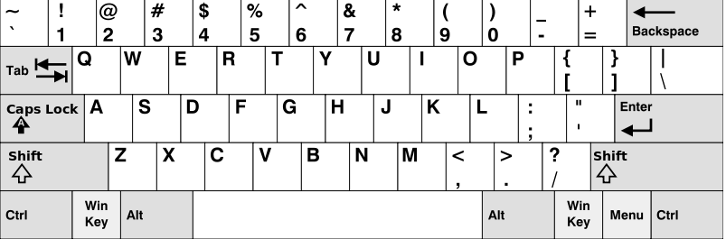

###Keyboard Row
第四天第7题
#####题目
Given a List of words, return the words that can be typed using letters of alphabet on only one row's of American keyboard like the image below.


Example 1:

Input: ["Hello", "Alaska", "Dad", "Peace"]
Output: ["Alaska", "Dad"]

Note:

1.You may use one character in the keyboard more than once.
2.You may assume the input string will only contain letters of alphabet.

#####代码

```language
void initMap(unordered_map<char,int> &temp)
    {
        temp['z']=1;
        temp['x']=1;
        temp['c']=1;
        temp['v']=1;
        temp['b']=1;
        temp['n']=1;
        temp['m']=1;

        temp['a']=2;
        temp['s']=2;
        temp['d']=2;
        temp['f']=2;
        temp['g']=2;
        temp['h']=2;
        temp['j']=2;
        temp['k']=2;
        temp['l']=2;


        temp['q']=3;
        temp['w']=3;
        temp['e']=3;
        temp['r']=3;
        temp['t']=3;
        temp['y']=3;
        temp['u']=3;
        temp['i']=3;
        temp['o']=3;
        temp['p']=3;

    }

    vector<string> findWords(vector<string>& words) {
        unordered_map<char,int> temp{};
        initMap(temp);
        int i=0;
        auto word=words.begin();
        while(word!=words.end()){
            string str=*word;
            auto iter=str.begin();
            int tID=temp[tolower(*iter)];
            while(iter!=str.end())
            {
                if(temp[tolower(*iter)]!=tID){
                    words.erase(word);
                    word--;
                    break;
                }
                iter++;
            }
            word++;
        }
        return words;
    }
```