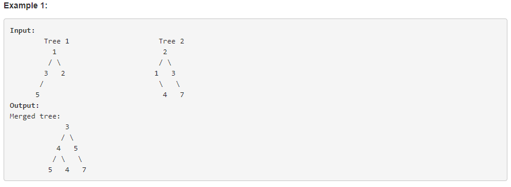

####Merge Two Binary Trees
第二天

######题目

Given two binary trees and imagine that when you put one of them to cover the other, some nodes of the two trees are overlapped while the others are not.

You need to merge them into a new binary tree. The merge rule is that if two nodes overlap, then sum node values up as the new value of the merged node. Otherwise, the NOT null node will be used as the node of new tree.



#### 代码
共使用了三种方法
```language

TreeNode *mergeTrees(TreeNode *t1, TreeNode *t2) {
#if 1
        if (t1 != NULL) {
            if (t2 != NULL) {
                t1->val = t2->val + t1->val;
                if (t1->left == NULL && t2->left != NULL) {
                    t1->left = t2->left;
                } else
                    mergeTrees(t1->left, t2->left);
                if (t1->right == NULL && t2->right != NULL) {
                    t1->right = t2->right;
                } else
                    mergeTrees(t1->right, t2->right);
            }
        } else {
            return t2;
        }
        return t1;
#elif 2
        if (t1 == NULL) return t2;
        if (t2 == NULL) return t1;
        t1->val += t2->val;
        t1->left = mergeTrees(t1->left, t2->left);
        t1->right = mergeTrees(t1->right, t2->right);
        delete t2;
        return t1;
#else
        if(!t1)
            return t2;
        if(!t2)
            return t1;
        TreeNode *node = new TreeNode(t1->val + t2->val);
        node->left = mergeTrees(t1->left, t2->left);
        node->right = mergeTrees(t1->right, t2->right);
        return node;
#endif
    }

```