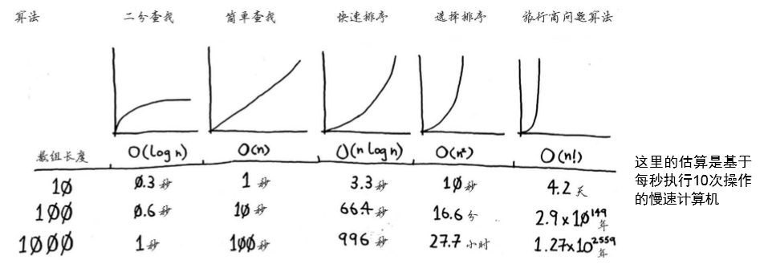

##快速排序
#####分而治之

例子：你要将这块地均匀地分成方块，且分出的方块要尽可能大
```java
	/**分割土地
	 * @param x 长
	 * @param y 宽
	 */
	public static void LandSub(int x,int y) {
		if(x==y) {System.out.println(x);}
		else if(x>y) {
			LandSub(x-y, y);
			System.out.println(y);
		}
		else {
			LandSub(x, y-x);
			System.out.println(x);
		}
	}
	
	/**分割土地
	 * @param x 长
	 * @param y 宽
	 */
	public static int LandSub1(int x,int y) {
		if(x==y) {System.out.println(x);
		return x*y;
		}
		else if(x>y) {
			return y*y+LandSub1(x-y, y);
		}
		else {
			return x*x+LandSub1(x, y-x);
		}
	}
```

######欧几里得算法
@[欧几里得算法](https://www.khanacademy.org/ computing/computer-science/ryptography/modarithmetic/a/the-euclidean-algorithm)

##### Haskell

#####快速排序实现
```java
	public static List<Integer> QucikS(List<Integer> list){
		if(list.size()<2)
			return list;
		else
		{
			List<Integer> pivots = new ArrayList<>();
			List<Integer> less = new ArrayList<>();
			List<Integer> greater = new ArrayList<>();
			Integer pivot=list.get(0);
			for(int i=0;i<list.size();i++) {
				if(list.get(i)==pivot) {
					pivots.add(list.get(i));
				}
				else if(list.get(i)<pivot) {
					less.add(list.get(i));
				}
				else {
					greater.add(list.get(i));
				}
			}
			list=new ArrayList<>();
			list.addAll(QucikS(less));
			list.addAll(pivots);
			list.addAll(QucikS(greater));
			return list;
		}
	}
```
######时间复杂度



#####合并排序
